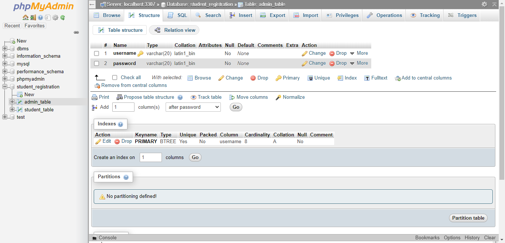
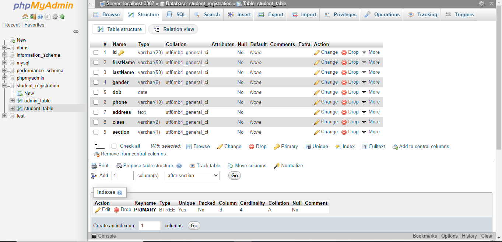

# Student-Registration-System
A java application built to manage student details at an institution. The application is built using Java, Swing, JDBC and MySQL. This application can be used to add students to database, search for existing students, edit their details and delete student records.

## Prerequisites
1. java jdk 1.8 or above
2. [connector/j](https://dev.mysql.com/downloads/connector/j/)
3. xampp for creating localhost server for mySQL databaase
4. [JDatechooser jar](http://plugins.netbeans.org/plugin/658/jdatechooser-1-2)

## Important guidelines
1. For creating a new admin, you must provide the school key which is by default set to 123456 and can be changed by going to line 498 of BioInit.java
2. Make sure to start Apache and MySQL from xampp control panel before running the application.
3. The database name by default is 'student_registration' and tables are 'student_table' and 'admin_table'.
4. The collation for admin_table fields are set to latin1_bin to support case sensitivity.

## Database Structure
### Admin Table Structure

### Student Table Structure

